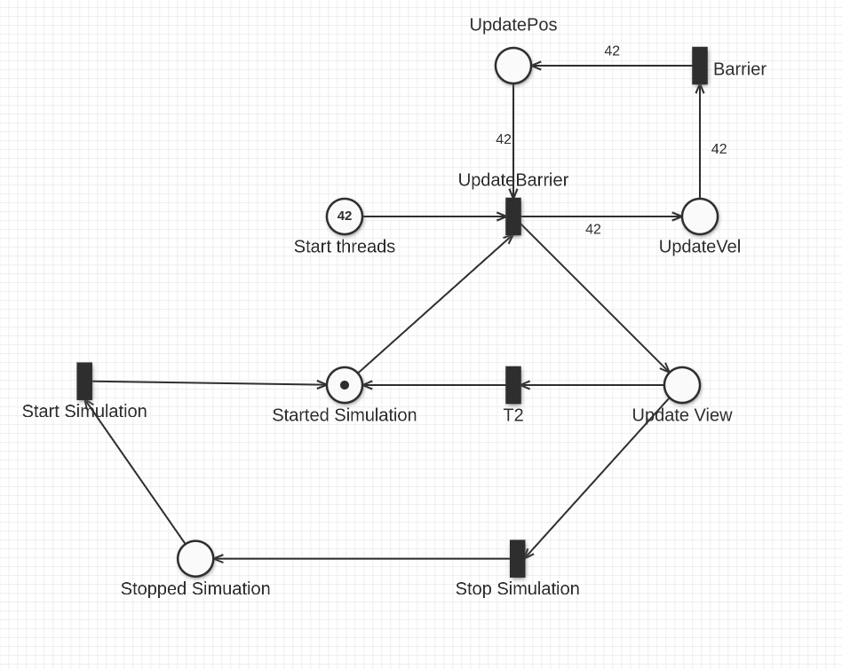

# Assignment #01 - Concurrent Boids
_by Marco Galeri marco.galeri@studio.unibo.it & Luca Patrignani luca.patrignani3@studio.unibo.it_

## Problem analysis
From a computation point of view the problem can be divided into three main sections:
1. Update of the boids' velocities
2. Update of the boids' positions
3. Update the view.

The bulk of the computation is found in the first two sections, so we concentrate our effort of performance improvement in those points. In order to keep the computational results correct all boids' velocities have to be calculated before updating the positions.
Analyzing the data dependencies we notice that the update of a boid's position depends only on its velocity. 
The velocity, on the other hand, depends on three factors:
- Separation, which depends on the surrounding previous boids' positions
- Alignment, which depends on  the surrounding boids' **velocities**
- Cohesion, which depends on the surrounding previous boids' positions.

The computations of separation and cohesion factors are not problematic because when updating boids' velocities the previous positions' computation has been already completed, avoiding any type of race conditions.
On the other hand, alignment is inherently problematic due to the fact that velocities depend on alignment and alignment depends on velocities. This, if not appropriately addressed, can lead to race conditions.

## Design
### Overall design
The proposed design is explicated by the following Petri Net: 
The upper part of the graph represents the computational part of the program using 42 threads as an example. The lower part models the controller, which is responsible for updating the view, stopping and restarting the simulation.
The `UpdateBarrier` is a barrier responsible for coordinating the controller thread with the computing threads. It guarantees two things:
- stopping and starting the threads avoiding any type of busy waiting
- synchronizing the computational threads, guaranteeing that the calculation of the new positions is terminated before the update of the view and the starting of the new iteration. This is done in order to avoid race conditions is accessing the boids' velocities.

The other `Barrier` is responsible to wait for the completion of velocities' update before updating the positions. This synchronization point guarantees the absence of race conditions in accessing the boids' positions.

### Race conditions in velocities' update
In order to address the race condition previously identified read-write locks have been introduced for each velocity vector. The `CalculateAligment` method will read-lock the other boid's velocity and `UpdateVel` method will write-lock its own velocity when updating it. 

### View-Controller synchronization
In order to 